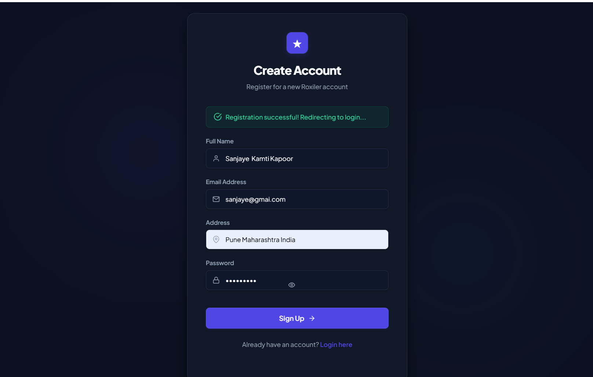
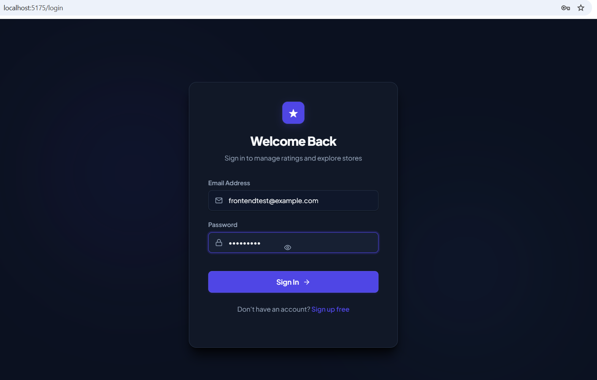
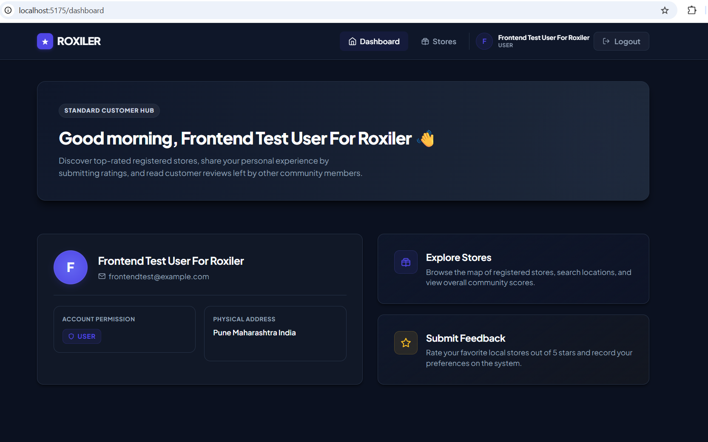
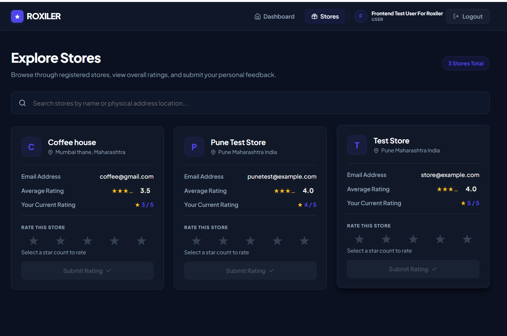
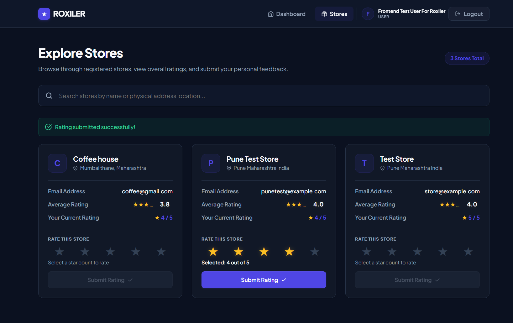
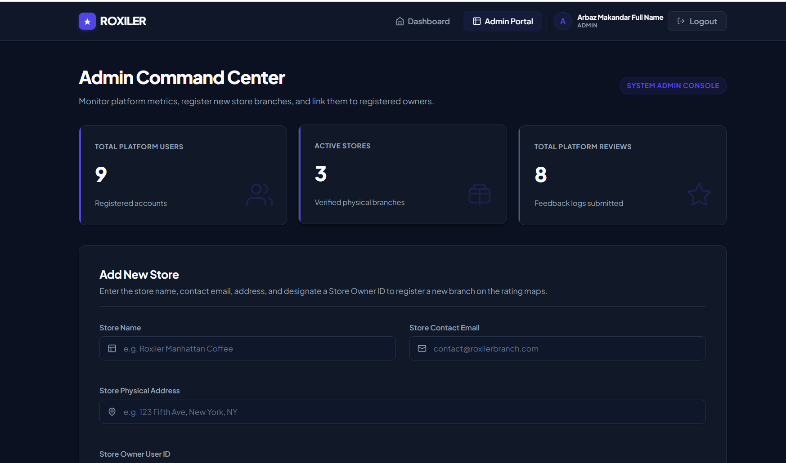
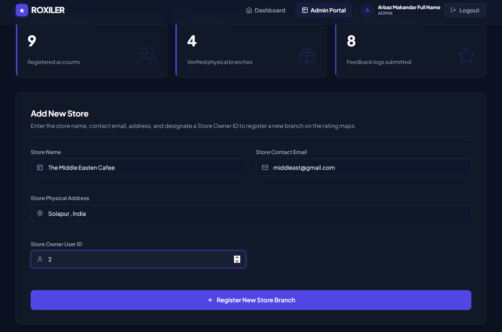
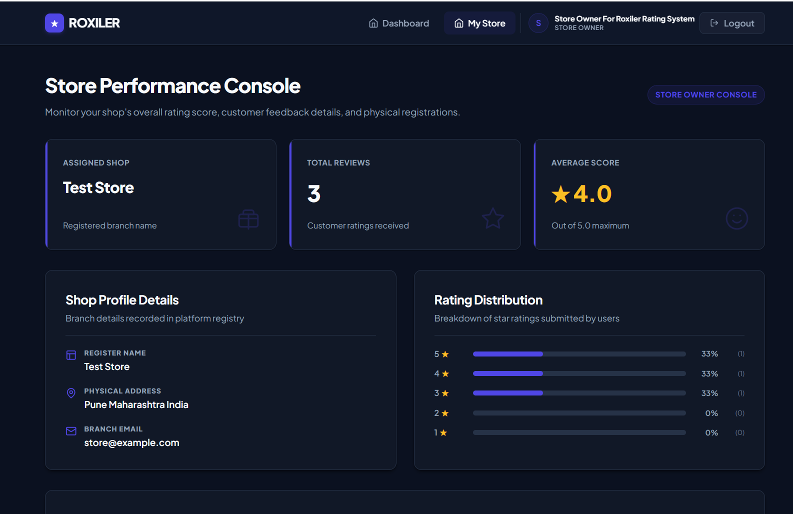
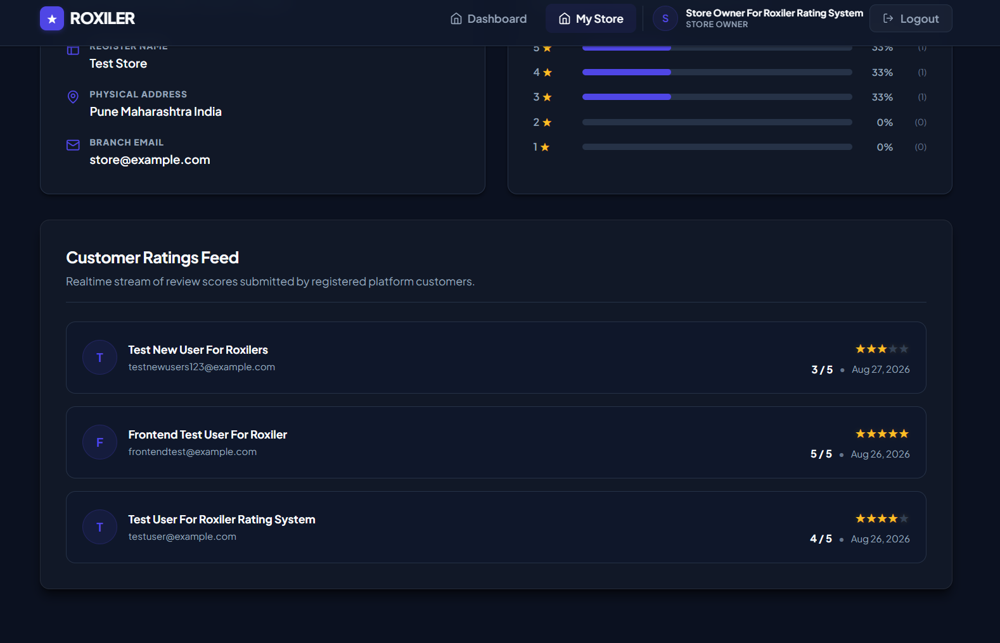

# ⭐ Roxiler Rating System

A full-stack **Store Rating Management System** developed as part of the **Roxiler Systems Full Stack Developer Intern Online Assessment**.

The application provides role-based access for **Normal Users, System Administrators, and Store Owners**, allowing users to discover stores, submit ratings, and manage store/rating information through dedicated dashboards.

---

## 🚀 Project Overview

The Roxiler Rating System is designed to provide a centralized platform where:

- Users can register and securely log in.
- Users can browse available stores.
- Users can submit and manage their ratings.
- Administrators can manage users and stores.
- Store Owners can monitor their store's ratings and customer activity.
- Role-based authorization ensures that each user can access only the functionality relevant to their role.

The application follows a modern client-server architecture with a React frontend, Express.js backend, and MySQL database.

---

# ✨ Key Features

## 👤 Normal User

- User registration
- Secure login
- Browse available stores
- Search/view store information
- Submit ratings from **1 to 5**
- View overall store ratings
- View personal rating for a store
- Update rating
- Protected user dashboard
- Logout functionality

## 🛡️ System Administrator

- Secure administrator login
- Administrator dashboard
- View system statistics
- Manage users
- Manage stores
- Create stores
- View store information
- Role-based access control

## 🏪 Store Owner

- Secure store-owner login
- Dedicated owner dashboard
- View store rating statistics
- View users who rated the store
- Monitor customer ratings
- Protected owner-only routes

---

# 📸 Application Screenshots

## 1. User Registration

Users can create an account by providing their name, email address, address, and password.



---

## 2. Login

A centralized login interface provides access to the application based on the user's assigned role.



---

## 3. User Dashboard

The user dashboard provides access to store discovery and rating functionality.



---

## 4. Store Explorer

Users can browse available stores and view their rating information.



---

## 5. Rating System

Users can submit ratings for stores using the 1–5 rating system.



---

## 6. Administrator Dashboard

Administrators have access to system-level statistics and management functionality.



---

## 7. Administrator Store Management

Administrators can manage store information through the administration interface.



---

## 8. Store Owner Dashboard

Store owners can monitor their store's rating information and activity.



---

## 9. Store Owner Ratings

Store owners can view users who have rated their store and analyze rating information.



---

# 🏗️ Application Architecture

```text
                    ┌─────────────────────┐
                    │     React Client    │
                    │                     │
                    │  Login / Dashboard  │
                    │  Stores / Ratings   │
                    └──────────┬──────────┘
                               │
                         HTTP / REST API
                               │
                    ┌──────────▼──────────┐
                    │    Express.js API   │
                    │                     │
                    │ Authentication      │
                    │ Authorization       │
                    │ Controllers         │
                    │ Validation          │
                    └──────────┬──────────┘
                               │
                         Sequelize ORM
                               │
                    ┌──────────▼──────────┐
                    │    MySQL Database   │
                    │                     │
                    │ Users               │
                    │ Stores              │
                    │ Ratings             │
                    └─────────────────────┘
                    🛠️ Technology Stack
Frontend
React.js
React Router
JavaScript / JSX
Vite
CSS
Responsive UI
Backend
Node.js
Express.js
REST APIs
JWT Authentication
bcrypt password hashing
Input validation
Database
MySQL
Sequelize ORM
Development Tools
Git
GitHub
VS Code / Cursor
Postman
Vite
🔐 Authentication & Security

The application implements several security mechanisms:

JWT-based authentication
Password hashing using bcrypt
Protected API routes
Role-based authorization
Server-side input validation
Client-side form validation
Unique email validation
Unique user/store rating constraint
Environment variables for sensitive configuration

Passwords are never stored as plain text in the database.

👥 Role-Based Access
Feature	                    User	     Admin	     Store Owner
Register	                 ✅	         —	           —
Login	                     ✅	        ✅	         ✅
View Stores	                 ✅	        ✅	         ✅
Submit Rating	             ✅	         —	           —
View Own Rating	             ✅	         —	           —
Admin Dashboard	              —	          ✅	           —
Store Management	          —	          ✅	           —
Owner Dashboard	              —	           —	        ✅
View Store Ratings	          —	           —	        ✅
Logout	                     ✅	         ✅	         ✅
🗄️ Database Design

The application uses three primary entities.

Users

Stores information about registered users and their roles.

Important fields include:

id
name
email
password
address
role

Supported roles:

ADMIN
USER
STORE_OWNER
Stores

Stores information about stores registered in the system.

Important fields include:

id
name
email
address
ownerId
Ratings

Stores ratings submitted by users.

Important fields include:

id
userId
storeId
rating

Ratings are restricted to values between 1 and 5.

A user can maintain a single rating for a particular store.

🔗 API Overview

The backend exposes REST API endpoints for authentication, stores, ratings, administration, and store-owner functionality.

Authentication
POST /api/auth/register
POST /api/auth/login
Stores
GET /api/stores
Ratings
POST /api/ratings
GET  /api/ratings/my/:storeId
GET  /api/ratings/store/:storeId
Administration
GET  /api/admin/dashboard
POST /api/admin/stores
Store Owner
GET /api/owner/dashboard
GET /api/owner/store
GET /api/owner/ratings

Protected endpoints require a valid JWT authentication token.

📁 Project Structure
roxiler-rating-system/
│
├── client/
│   ├── src/
│   │   ├── components/
│   │   │   └── Navbar.jsx
│   │   │
│   │   ├── pages/
│   │   │   ├── Login.jsx
│   │   │   ├── Register.jsx
│   │   │   ├── Dashboard.jsx
│   │   │   ├── Stores.jsx
│   │   │   ├── AdminDashboard.jsx
│   │   │   └── OwnerDashboard.jsx
│   │   │
│   │   ├── api/
│   │   ├── App.jsx
│   │   ├── main.jsx
│   │   └── index.css
│   │
│   └── package.json
│
├── server/
│   ├── src/
│   │   ├── config/
│   │   ├── controllers/
│   │   ├── middleware/
│   │   ├── models/
│   │   ├── routes/
│   │   ├── validators/
│   │   └── index.js
│   │
│   └── package.json
│
├── screenshots/
│   ├── 01-registration.png
│   ├── 02-login.png
│   ├── 03-user-dashboard.png
│   ├── 04-store-explorer.png
│   ├── 05-rating.png
│   ├── 06-admin-dashboard.png
│   ├── 07-admin-store-management.png
│   ├── 08-owner-dashboard.png
│   └── 09-owner-ratings.png
│
└── README.md
⚙️ Local Installation
1. Clone the repository
git clone https://github.com/ArbazMakandar/roxiler-rating-system.git
cd roxiler-rating-system
2. Install frontend dependencies
cd client
npm install
3. Install backend dependencies

Open another terminal:

cd server
npm install
🔧 Environment Configuration

The backend requires environment variables for database and authentication configuration.

Create a .env file inside the server directory and configure it according to the project's database and authentication settings.

Example structure:

PORT=5000

DB_HOST=localhost
DB_PORT=3306
DB_NAME=roxiler_rating_system
DB_USER=your_mysql_username
DB_PASSWORD=your_mysql_password

JWT_SECRET=your_secure_jwt_secret

Important: Never commit the actual .env file or passwords/secrets to GitHub.

🗃️ Database Setup

Create the MySQL database:

CREATE DATABASE roxiler_rating_system;

Then configure the database credentials in the backend .env file.

From the server directory, initialize the database tables using the project's database synchronization script.

node src/sync-database.js
▶️ Running the Application
Start the backend

From the server directory:

node index.js

The backend runs on:

http://localhost:5000
Start the frontend

Open another terminal and run:

cd client
npm run dev

The frontend will normally be available at:

http://localhost:5173
🧪 Production Build Verification

The frontend production build was successfully verified using:

npx vite build

The build completed successfully with all frontend modules transformed and the production assets generated.

🌿 Git Branch

The completed premium frontend implementation is available on:

frontend-premium

The main branch has been retained as a stable backup during development.

🎯 Assessment Context

This project was developed as part of the:

Roxiler Systems – Full Stack Developer Intern Online Assessment

The implementation focuses on:

Full-stack development
Role-based authentication
Store management
Rating functionality
REST API development
Database integration
Secure password handling
Responsive and professional frontend design
👨‍💻 Developer

Arbaz Makandar

Computer Science Engineering Student

GitHub:

https://github.com/ArbazMakandar

📄 License

This project was developed for educational and recruitment assessment purposes.


## Step 2 — Save the README

After pasting:

**`Ctrl + S`**

Then your project should look like:

```text
roxiler-rating-system
│
├── client
├── server
├── screenshots
│   ├── 01-registration.png
│   ├── 02-login.png
│   ├── ...
│   └── 09-owner-ratings.png
│
└── README.md